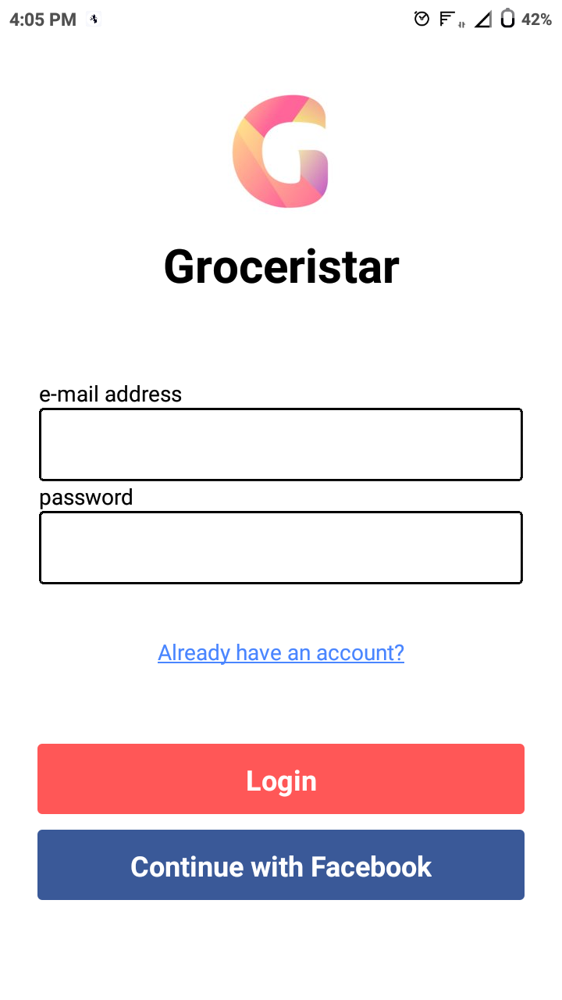

# test-video

## VIDEO

<video controls="controls" poster="img/demo.jpg" width="640" height="360">
    <!-- .mp4 file for native playback in IE9+, Firefox, Chrome, Safari and most mobile browsers -->
    <source src="./shopping-list.mp4" type="video/mp4" />
    <!-- flash fallback for IE6, IE7, IE8 and Opera -->
    <object type="application/x-shockwave-flash"
            data="swf/flowplayer-3.2.18.swf" width="640" height="360">
        <param name="movie" value="swf/flowplayer-3.2.18.swf" />
        <param name="allowFullScreen" value="true" />
        <param name="wmode" value="transparent" />
        <param name="flashVars"
               value="config={'playlist':['..%2Fimg%2Fdemo.jpg',{'url':'..%2Fvid%2Fdemo.mp4','autoPlay':false}]}" />
        
    </object>
</video>
